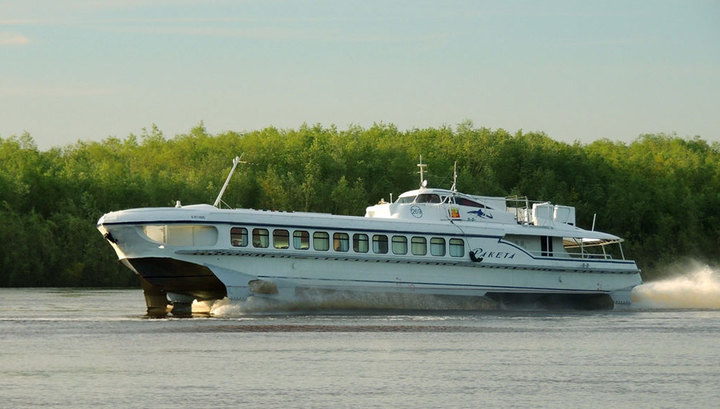
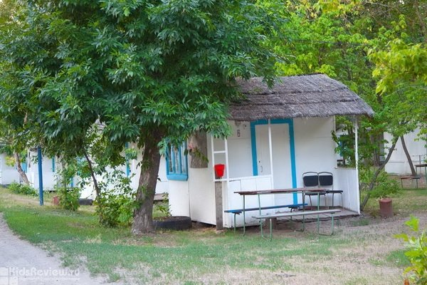
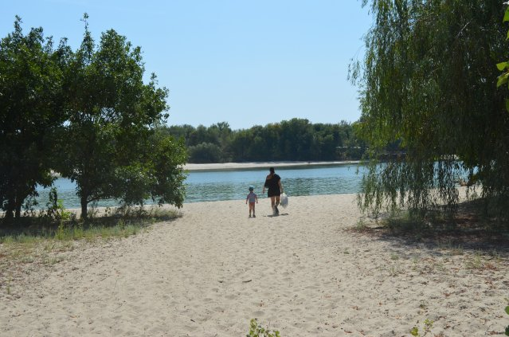

# Memories

### First memories 

It is summer - time to visit Bagajevka. It was just few hours away - up on the river Done from Rostov. We get there on "raketa" - a small cucamber-like boat. After, we walk to the destination for several hours caring huge heavy backpacks. Or at least this is how I remember the road there.

The one-room-houses were waiting for us. Now I realize how absurdly tiny the houses were, but to the 3 years old me they seemed just right. They smelled woody, old, empty, but at the same time it was the smell of so many things. Indeed, there those small life-less creatures were - waiting, craving to be used, to serve, to amuse. But just for one week - then wait again, hopefully just for couple of hours, for another family. In the house, there were always two beds, a fridge, a table, several chairs, and small cabinets next to each bed. When we were lucky, there were also cutlery, glasses, chess desc, cards and other less practical things. I remember, being especially happy when there was a chess desc.

On the "recreation basis perimeter" there were also shared spaces, such as a kitchen and a leisure room. I was terrified of the kitchen - it was too big, there were too many people and food smells, and everyone was smoking. But I loved the leisure room. Because there was a billiard table. I was probably merely seeing on the table itself, but I was fascinated by the sophisticated process the sticks needed to be covered first, ready to "pogonat meci", the balls falling down the wholes. The entry and the game were free, meaning that the room was always welcoming me, even when there were no one inside. 

Mornings and afternoons we spend on the river Don. There were so many barzas, drifting the river back and force. Sometimes empty, sometimes fully loaded, they inhaled and exhaled water in the river over and over, making children playing in the sand incredibly excited. 

During those days I felt happy. I also remember feeling independent, and joyful. I know that mama felt the same way. Even she probably felt so much more in those easy summer days that I did. 

