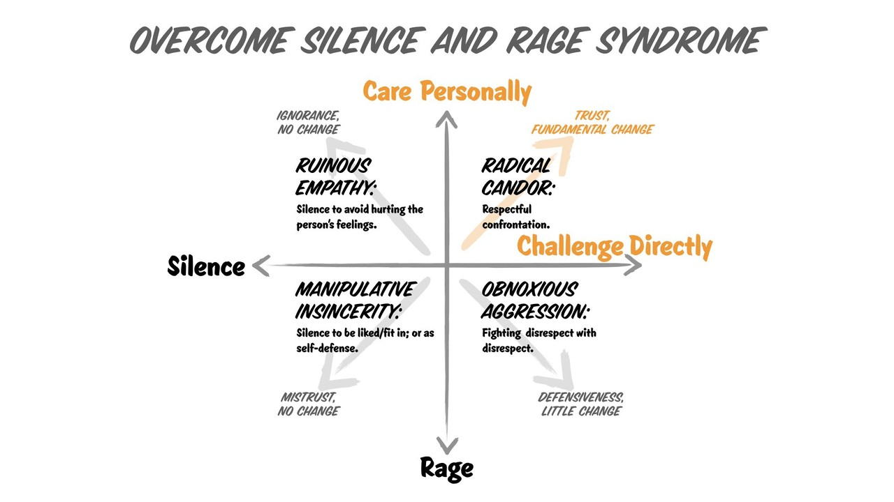

# \[April, 2020\] Radical Candor: Be a Kickass Boss Without Losing Your Humanity by Kim Malone Scott

Links: [goodreads](https://www.goodreads.com/book/show/29939161-radical-candor?ac=1&from_search=true&qid=Ay9Ug2CHK0&rank=3)

First Published:

My rating: ⭐ ⭐ ⭐ ⭐ 

Categories/Tags: self-growth, management, team work, success 

## What I like the most about the book:

* Very honest, contains lessons learned on mistakes & misunderstanding
* Contains many stories about managing from Facebook, Google, Tweeter  

## Notes and Facts:

* Boss/manager = partner 
* Knew what drives/motivates each person in your team 
* Challenge directly and ask people to do the same 
* Practice radical candid "up", "down", "sideways"

### Radical Candor

* Can be applied outside of work as well 
* Give explanation to both prise and critics

### Obnoxious Aggression

* When criticising about caring
* Might be better than MI or RE - honest, team still is able to archive results 
* The worst kind of aggression happens when boss understands other person's vulnerability 
* Prise can be obnoxiously aggressive, too 

### Manipulative Insincerity 

* When you do not care to challenge directly 
* False apology 

### Ruinous Empathy 

## Thoughts and Ideas:

-

## What related sources I've checked while reading:

-

## Other:

-

