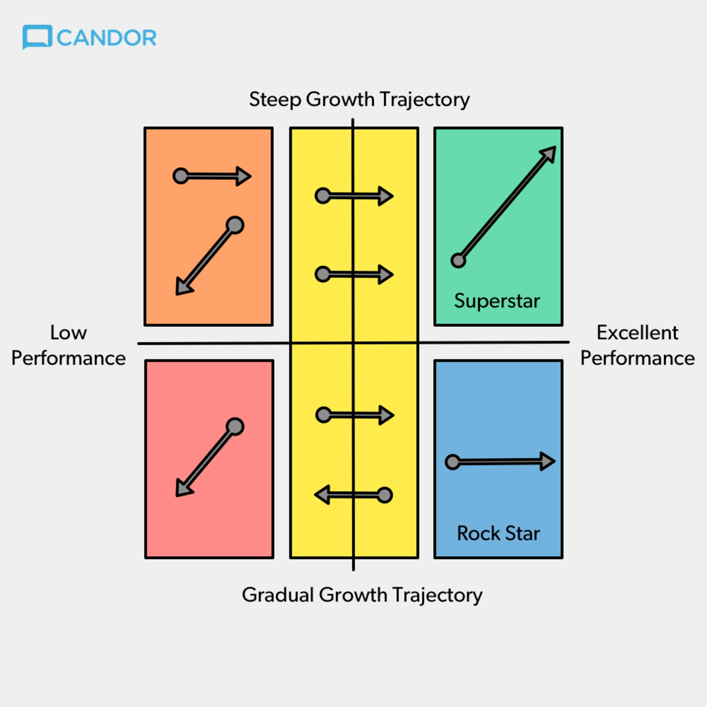

# \[April, 2020\] Radical Candor: Be a Kickass Boss Without Losing Your Humanity by Kim Malone Scott

Links: [goodreads](https://www.goodreads.com/book/show/29939161-radical-candor?ac=1&from_search=true&qid=Ay9Ug2CHK0&rank=3)

First Published:

My rating: ⭐ ⭐ ⭐ ⭐ 

Categories/Tags: self-growth, management, team work, success 

## What I like the most about the book:

* Very honest, contains lessons learned on mistakes & misunderstanding
* Contains many stories about managing from Facebook, Google, Tweeter  

## Notes and Facts:

* Boss/manager = partner \(absent manager -- partner -- micromanager\)
* Knew what drives/motivates each person in your team 
* Challenge directly and ask people to do the same 
* Practice radical candid "up", "down", "sideways"
* Don't dish it out before you show you can take a criticism 
* Ask: "What I can do to make you live better?"
* Reword candor and criticism 
* "You work is shit" - SJ - still not personal, very straight and left no room for disc.
* "Just say it" 
* "Give a damn"
* Give people change to fix their mistakes 
* Recognise, what is your job: to convince, to tell the truth, to care personally etc 

### RC Quadrants

#### Radical Candor

* Can be applied outside of work as well 
* Give explanation to both prise and critics

#### Obnoxious Aggression

* When criticising about caring
* Might be better than MI or RE - honest, team still is able to archive results 
* The worst kind of aggression happens when boss understands other person's vulnerability 
* Prise can be obnoxiously aggressive, too 

#### Manipulative Insincerity 

* When you do not care to challenge directly 
* False apology 

#### Ruinous Empathy 

* Problem of "Just trying to say something nice"
* Do research before giving a praise \(especially publicly\) 

### Growth  

####  Rockstars

* Force for stability; ambitious outside of work or simply content in life; happy in the current role
* Recognise, reward, do not promote \(might be dangerous\) 

**Superstars** 

* Change agent; Ambitious at work; Want new opportunities
* Keep them challenged 
* .. but figure out who will replace them when they are gone 

#### Other:

* Just avoiding firing; before firing: 
  * Third opinion 
  * how the person effects the team
  * Be radically candored
* Common lies: 
  * It will get better
  * Somebody is better then nobody 
  * A transfer is the answer 
  * It's bad for team's morale 
* Reason of performing poorly: 

  * Wrong role
  * Too much, too fast 
  * Poor fit with the company 
  * Personal problems

## Thoughts and Ideas:

-

## What related sources I've checked while reading:

-

## Other:

-

